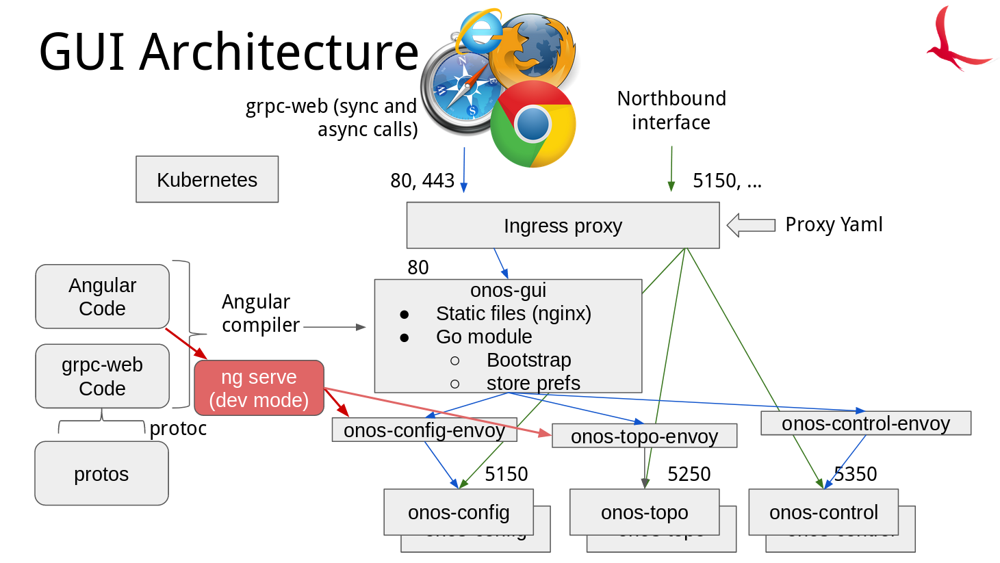

# onos-gui Architecture
The GUI is architected as a Cloud Native application to be run on Kubernetes
accessing the back end modules through gRPC (and in the case of the Config GUI
mostly through gNMI).



The main front end technology is [Angular](https://angular.io) and is
supplemented by [gRPC Web](https://github.com/grpc/grpc-web) to access the back
through a gRPC proxy.

[Nginx](https://nginx.org/) acts as a web server and web Proxy, while
[Envoy](https://www.envoyproxy.io/) proxy server acts as a grpc-web proxy and
all are deployed on [Kubernetes](https://kubernetes.io/).

While 2 proxies seem to be an overhead, it is unavoidable at present because:

* nginx cannot do the grpc-web proxying (while there was a
[module](https://github.com/grpc/grpc-web/tree/master/net/grpc/gateway/nginx) written for
nginx in the grpc-web project, this [does not work](https://github.com/grpc/grpc-web/issues/372#issuecomment-438045235)
with anything beyond nginx v1.14.2)

* Envoy cannot load static web pages, and so nginx is required to perform this role

## Alternatives to grpc-web
There are some alternatives to using grpc-web to allow web browsers to access
gRPC directly, but grpc-web is the recommended solution as per the gRPC [website](https://grpc.io/docs/tutorials/basic/web/).

See also [this article on hacker noon](https://hackernoon.com/interface-grpc-with-web-using-grpc-web-and-envoy-possibly-the-best-way-forward-3ae9671af67).

## Access to Kubernetes API
An instance of `kubectl proxy` runs inside the `onos-gui` pod alongside `nginx`.
This exposes the Kubernetes REST API on port 8001.

The `nginx` server then proxies that to http://localhost:80/kubernetes-api

The application can then access the API like:
```
HTTP GET http://localhost:80/kubernetes-api/api/v1/namespaces/onos/services
```

The `onos-gui` pod needs to be given RBAC permission of `list` and `get` to be able
to read these services. This is granted in the Helm Chart. 
