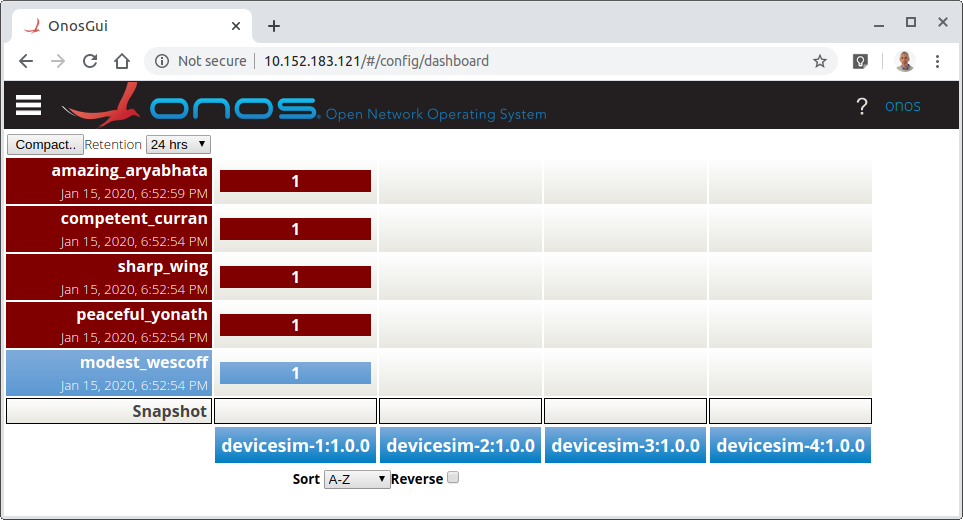
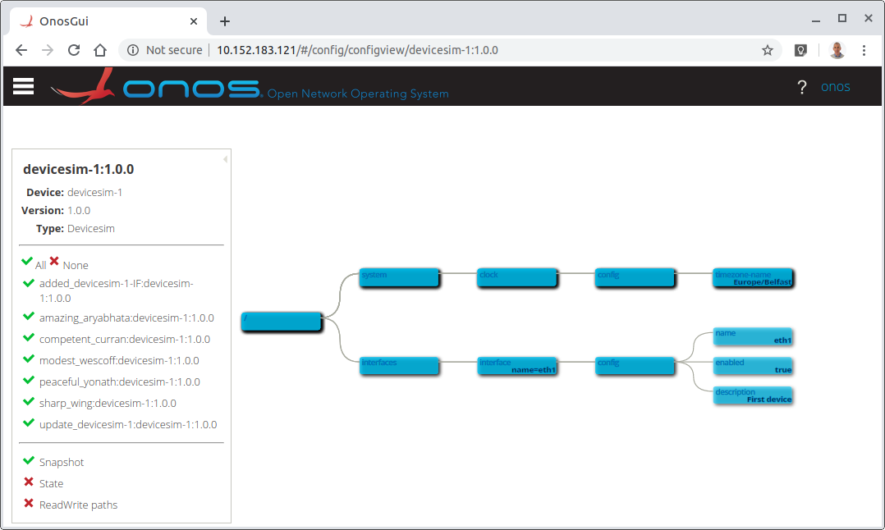
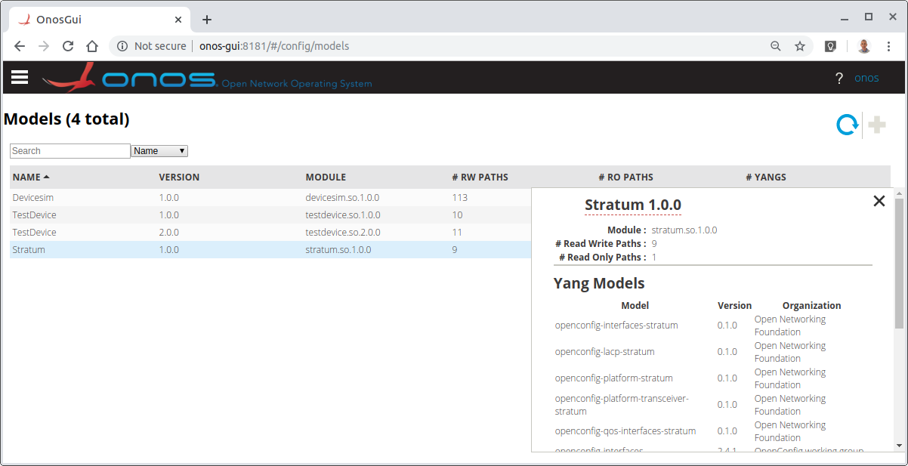

<!--
SPDX-FileCopyrightText: 2020-present Open Networking Foundation <info@opennetworking.org>

SPDX-License-Identifier: Apache-2.0
-->

# Configuration GUI
The configuration GUI reflects configuration changes made in to onos-config.

## Dashboard View
The **Dashboard view** is the default, and shows all the devices and their network changes
in a tabular layout. Other views are available through the menu on the top left or
through hyperlinks (e.g. on the device).

* A corresponding Details view shows individual details
* Rollback of the last `NetworkChange`
* Compaction of `NetworkChange`s older than a certain time (24 hours by default)
* Access to a Device View through a link

## Device View
Device View is a graphical layout that shows the entire configuration of the
device in a tree view.

* It contains a panel that lists all of the `DeviceChanges` that have happened
to the device. Each of these can be hidden or displayed (like a layer) that
can be used to see the history of config changes.
* An additional layer shows the `Snapshot` for that device
* Another layer shows the Operational State (from the OpState cache) when
connected to a real device
* Another layer shows all of the configurable (Read Write) paths possible for
the device. 
* Zoom and Pan functions are also available within the graphical view

## Model View  
Model View is a tabular layout that shows the list of Model Plugins loaded in
the system.

* A details view shows the list of YANG models for that Model Plugin. 

## Developer information
### Implementation
When the **Config view dashboard** is loaded:

1. A grpc-web request is formed and sent as a POST to [http://10.152.183.121/onos-config/onos.config.diags.ChangeService/ListNetworkChanges](http://onos-gui:8181/onos-config/onos.config.diags.ChangeService/ListNetworkChanges)
1. This is forwarded by a `proxy_pass` declaration in `nginx.conf` to [http://localhost:8081](http://localhost:8081)
1. This is converted in to a gRPC request by Envoy Proxy server's grpc-web filter
1. and is forwarded to [https://onos-config:5150](https://onos-config:5150) as a gRPC request
1. onos-config sends back the response to envoy asynchronously as a gRPC response
1. Envoy's grpc-web service turns it in to a grpc-web response and sends it back to nginx
1. nginx sends the response back to the browser and the callback function is called
1. Inside the browser the callback updates the `networkChanges` object inside the ConfigDashboardComponent
1. the binding in the config-dashboard.component.html page is alerted to the updated value and refreshes the display
1. similar calls are made to load the `snapshots` and `devices`
