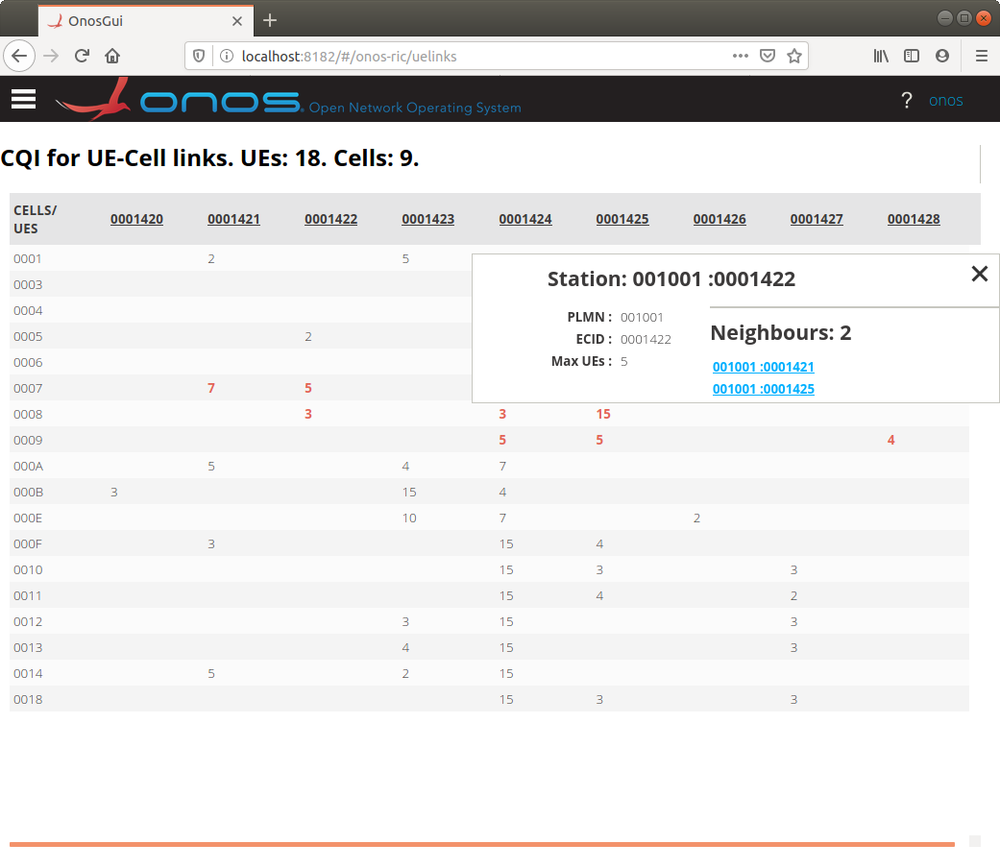
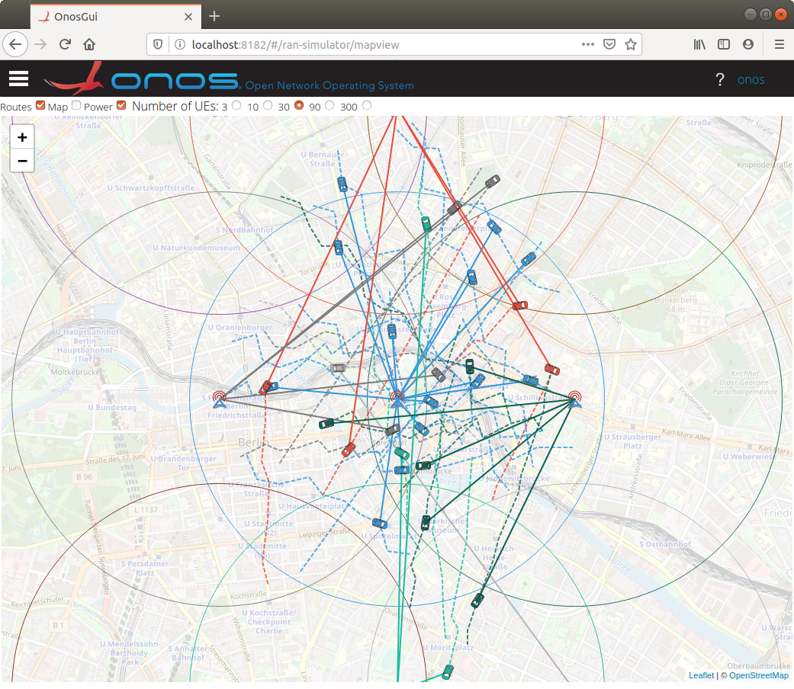

<!--
SPDX-FileCopyrightText: 2020-present Open Networking Foundation <info@opennetworking.org>

SPDX-License-Identifier: Apache-2.0
-->

# RAN GUI
The RAN GUI demonstrates the `onos-ric` micro-service and the accompanying `ran-simulator`.

## UELinks View
The **UELinks** view shows the affinity of a User Equipment device (mobile phone)
to cell towers in the network. It presents a tabular layout with Cell Towers
across the top and UEs in the rows. The values shown are Call Quality Indicators (CQIs)
and vary as the UE's move around between towers.

## Map view
The **Map view** shows all of the towers and UEs in teh simulator located on a
Map.

Each tower has 3 or more **cells**, each casting a beam outwards it indicating its
power setting. This too can be turned on or off. Each cell has a different color
beam. A line is also shown - radiating from the tower to the centroid of the
cell's area of coverage. This too adjusts with the power level.

The UE travels along a route, and the color of the UE matches the cell it is
connected to. If a UE is handed over to a different tower, it increases momentarily
in size and changes to the color of the new serving tower. 

The routes that the UEs can take can be seen as dashed lines (and can be turned
on and off). The color of the route matched the UE.

A line connects each UE to its **serving cell**. The color of the line changes   
depending on the tower.

The number of UEs can be varied by clicking the radio buttons at the top. The
minimum and maximum values are set through the startup parameters of the 
`ran-simulator` - see [ran-simulator/docs/README.md](https://github.com/onosproject/ran-simulator/blob/master/docs/README.md)

Normally the MapView connects to the `ran-simulator` microservice and constantly
listens to streaming gRPC messages updating the towers and UE's. This can be
disconnected however by clearing on the "Connected" checkbox.

> This removes the burden of streaming from the `ran-simulator` while not connected.
> While making latency measurements all GUIs should be disconnected

Single updates of the current state can be had by clicking the "Refresh" button.

> This can be useful to get a visual snapshot of UE counts and positions while not
> burdening the system with constantly having to send updates.

